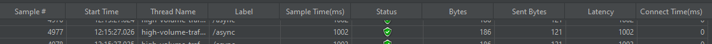

# How to handle high volume traffic in Spring Boot examples

1. [Use @Async](#AsyncExample)
2. [Use @Cacheable](#Cacheable)
3. [Use Compression](#Compression)

## <a name="AsyncExample"></a> Use @Async
* Async Test URL: `http://localhost:8080/async`
* Sync Test URL: `http://localhost:8080/sync`  
To improve `@Async` performance, additional ThreadPool configuration is required
```java
@Configuration
public class AsyncConfig {
    @Bean(name="taskExecutor")
    public Executor taskExecutor(){
        ThreadPoolTaskExecutor executor = new ThreadPoolTaskExecutor();
        executor.setCorePoolSize(100);
        executor.setMaxPoolSize(1000);
        executor.setQueueCapacity(50);
        executor.setThreadNamePrefix("Async-");
        executor.initialize();
        return executor;
    }
}
```
* Also need to annotate the configuration class with `@EnableAsync`
* Use `CompletableFuture<~>` return type for `@Async` method 

### Test result - Jmeter
* Number of Threads (users): 5000
* Ramp-up period(seconds): 10
* Loop Count: 1

The result is clear. Using `@Async` service provides consistent response time until the end of performance test while sync service performance goes down dramatically

#### Sync Service

#### Async Service


## <a name="Cacheable"></a> Use @Cacheable 
* Test URL: `http://localhost:8080/cached`  
Calls the following Service component with `@Cacheable` annotation
```java
@Service
public class CachedService {

    @Cacheable(value="cached-single")
    public String getHello(){
        System.out.println("Fetching and cache the data:"+System.currentTimeMillis());
        try{
            Thread.sleep(1000);
        }catch( InterruptedException e){
            Thread.currentThread().interrupt();
        }

        return "Cached Hello";
    }
}
```

### Test environment - Jmeter
__Note__: This is local machine test, so it cannot measure as standard result
* Number of Threads(users): 6000
* Ramp-up period(seconds): 10
* Loop Count: 1

__Result__: You will see latency drops down dramatically after a few hundred requests. It needs to pass a few hundreds request because of Thread.sleep setting.

## <a name="Compression"></a> Use Compression 
* Test URL: `http://localhost:8080/compressed`

Add following configuration in application.yml
```yaml
server:
  compression:
    enabled: true
    min-response-size: 1024
    mime-types: application/json,application/xml,text/html,text/xml,text/plain
```
Then call `http://localhost:8080/compressed` with `Accept-Encoding: gzip` in the Request Header.
You will see the response body `Bytes` size difference
* Result with header `Accept-Encoding: gzip` on  


* Result without header `Accept-Encoding: gzip` on
  